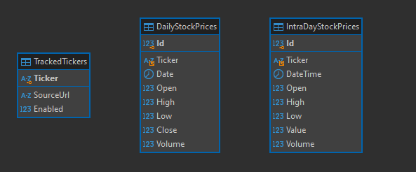

This is a crawler application written in golang which uses 'https://www.infomoney.com.br' as datasource to extract stock prices daily in ochlv format 
and extract intra day prices in m15 period

This application stores their data into a MySQL Database which the following model



Also this aplication is desined to run as CronJobs at kubernetes 

```yaml
apiVersion: batch/v1
kind: CronJob
metadata:
  name: daily-crawler
  labels:
    app: daily-crawler
spec:
  schedule: "0 20 * * 1-5"
  successfulJobsHistoryLimit: 3
  failedJobsHistoryLimit: 3
  jobTemplate:
    spec:
      template:
        spec:
          containers:
            - name: daily-crawler
              image: daily-crawler:local
              imagePullPolicy: IfNotPresent
              env:
                - name: DB_USER
                  value: <your-db-user>
                - name: DB_PASS
                  value: "<your-db-password>"
                - name: DB_ADDR
                  value: "mysql-svc.default.svc.cluster.local:3306"

          restartPolicy: Never

---
apiVersion: batch/v1
kind: CronJob
metadata:
  name: intraday-crawler
  labels: 
    app: intraday-crawler
spec:
  schedule: "*/15 10-20 * * 1-5"
  successfulJobsHistoryLimit: 4
  failedJobsHistoryLimit: 4
  jobTemplate:
    spec:
      template:
        spec:
          containers:
            - name: intraday-crawler
              image: intraday-crawler:local
              imagePullPolicy: IfNotPresent
              env:
                - name: DB_USER
                  value: <your-db-user>
                - name: DB_PASS
                  value: "<your-db-password>"
                - name: DB_ADDR
                  value: "mysql-svc.default.svc.cluster.local:3306"
          restartPolicy: Never

``` 